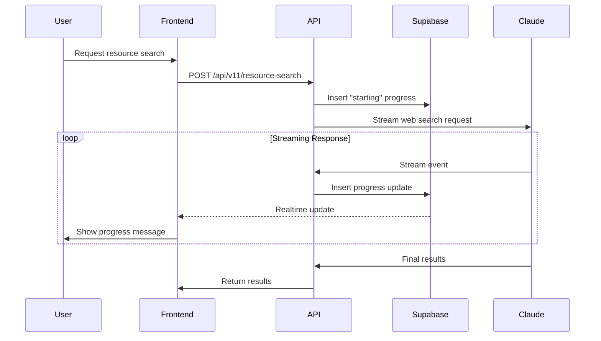

file: docs/resource_search_progress_updates.md

# Resource Search Progress Updates Architecture

## Overview

This document describes the implementation of real-time progress updates during Claude's web search API execution for the resource locator feature. The system provides users with frequent, conversational status updates while Claude searches for resources, creating a more engaging and transparent search experience.

## Problem Statement

When users request resource searches (e.g., "find emergency shelters in Detroit"), the Claude web search API can take 10-30+ seconds to complete. Without progress updates, users see only:
- Initial message: "Let me search for that information..."
- Long silence
- Final results

This creates uncertainty and a poor user experience.

## Solution Architecture

### 1. Real-time Progress Updates via Supabase

We implemented a real-time progress update system using:
- **Supabase Realtime**: For instant delivery of progress updates
- **Database persistence**: Progress updates stored in `progress_updates` table
- **WebSocket subscriptions**: Client subscribes to updates for specific request IDs

### 2. Database Schema

```sql
CREATE TABLE progress_updates (
  id BIGSERIAL PRIMARY KEY,
  request_id TEXT NOT NULL,  -- Short request ID like "642486"
  user_id UUID REFERENCES auth.users(id) ON DELETE CASCADE,
  message TEXT NOT NULL,
  stage TEXT NOT NULL,
  created_at TIMESTAMPTZ DEFAULT NOW()
);
```

Key design decisions:
- `request_id` as TEXT (not UUID) to support short, user-friendly IDs
- Automatic cleanup of old records (>1 hour)
- Row Level Security for user privacy

### 3. Progress Update Flow



### 4. Message Variety System

To avoid repetitive updates, we implemented a message variety system with multiple message options per stage:

```typescript
const SEARCH_MESSAGES = {
  starting: [
    "Let me search for that information...",
    "I'll find some up-to-date details...",
    "Searching for current resources...",
    // ... more variations
  ],
  preparing: [
    "Setting up the search parameters...",
    "Preparing to search multiple sources...",
    // ... more variations
  ],
  analyzing: [
    "Analyzing your request and formulating search queries...",
    "Breaking down your question to find the best answers...",
    // ... more variations
  ],
  // ... more stages
};
```

### 5. Streaming Event Mapping

Claude's streaming API emits various events that we map to user-friendly progress stages:

| Claude Event | Progress Stage | User Sees |
|--------------|----------------|-----------|
| `content_block_start` | `tool_start` | "Preparing to search multiple sources..." |
| `input_json_delta` | `query_analysis` | "Analyzing your request..." |
| `tool_use` (web_search) | `web_searching` | "Searching the web for: [query]..." |
| `content_block_stop` | `processing_results` | "Processing search results..." |
| `message_stop` | `finalizing` | "Finalizing the resource list..." |

### 6. Client-Side Implementation

The `SearchProgressToast` component:
1. Subscribes to Supabase Realtime channel for the specific request
2. Updates UI with each new progress message
3. Maintains conversation history for context
4. Auto-scrolls to show latest updates

```typescript
// Subscribe to progress updates
channel = supabase
  .channel(`progress-${requestId}`)
  .on('postgres_changes', {
    event: 'INSERT',
    schema: 'public',
    table: 'progress_updates',
    filter: `request_id=eq.${requestId}`
  }, handleProgressUpdate)
  .subscribe();
```

## Implementation Challenges & Solutions

### Challenge 1: UUID Type Mismatch
**Problem**: Initial implementation used UUID type for request_id, but system generated short IDs
**Solution**: Changed column to TEXT type to support flexible ID formats

### Challenge 2: Serverless Environment
**Problem**: Global Map storage didn't work in Vercel's serverless environment
**Solution**: Moved to Supabase for persistent, distributed storage

### Challenge 3: Message Repetition
**Problem**: Same messages appearing multiple times
**Solution**: Implemented message variety system with usage tracking

## Performance Considerations

1. **Debouncing**: Not implemented as each progress update provides value
2. **Cleanup**: Automatic deletion of updates older than 1 hour
3. **Indexing**: Indexes on request_id and created_at for fast queries
4. **Realtime Efficiency**: Single channel subscription per search request

## Debugging & Monitoring

Enable progress update logs with:
```bash
NEXT_PUBLIC_ENABLE_PROGRESS_UPDATE_LOGS=true
```

Logs are written to:
- Browser console: `[progress_update]` prefix
- Server logs: `logs/progressUpdates.log`

## Future Enhancements

1. **Progress Percentage**: Add numerical progress indicators
2. **Estimated Time**: Show estimated completion time
3. **Cancel Functionality**: Allow users to cancel long-running searches
4. **Fallback Mode**: Polling mechanism if WebSocket fails
5. **Internationalization**: Localized progress messages

## Security Considerations

- Row Level Security ensures users only see their own progress
- No sensitive data in progress messages
- Request IDs are non-guessable (though not cryptographically secure)
- Automatic cleanup prevents data accumulation

### RLS Policy Issue (Temporary Fix)

**⚠️ IMPORTANT: Current RLS policies have been relaxed for testing purposes.**

The original RLS policies were too restrictive and prevented the API from inserting progress updates:
```sql
-- Original policy required auth.uid() = user_id
-- But API routes insert with user_id = null when user is not authenticated
```

**Current temporary solution:**
- Removed strict RLS requirements
- Allow anonymous inserts and viewing
- This is NOT secure for production

**TODO: Implement proper solution:**
1. Use Supabase service role key for API inserts (bypasses RLS)
2. Or pass proper user context from frontend to API
3. Or implement API key authentication for system operations
4. Consider using Supabase Edge Functions that can operate with elevated privileges

**Security risks with current approach:**
- Any client can insert progress updates
- Progress updates are visible to anyone with the request_id
- No audit trail of who created updates

This must be addressed before production deployment.

## Known Issues

### Excessive Progress Updates

The current implementation generates far too many progress updates (80+ for a single search). This creates:
- Visual noise for users
- Unnecessary database writes
- Network overhead
- Poor user experience with rapidly changing messages

**Example**: A single search generated 221 progress updates, with many duplicate stages like:
- 30+ "query_analysis" updates
- 40+ "processing_results" updates
- Multiple identical messages in succession

### Prompt for Next Session to Fix Excessive Updates

```
The resource search progress update system is generating excessive updates (80-200+ per search). 
Please analyze and fix this issue:

1. **Identify the root cause**:
   - Check why Claude's streaming API emits so many duplicate events
   - Look for events being processed multiple times
   - Investigate if every stream chunk triggers an update

2. **Implement throttling/debouncing**:
   - Add time-based throttling (e.g., max 1 update per 2 seconds per stage)
   - Implement stage-based deduplication (don't repeat same stage within X seconds)
   - Consider message-based deduplication (don't repeat identical messages)

3. **Optimize update frequency**:
   - Target 5-10 meaningful updates per search
   - Focus on major state transitions, not every micro-event
   - Group related events before emitting updates

4. **Suggested implementation approaches**:
   - Add a throttle mechanism in processStreamingResponse()
   - Track last update time per stage
   - Buffer updates and emit periodically
   - Skip redundant stage transitions

5. **Expected behavior**:
   - Starting → Analyzing → Searching → Processing → Finalizing
   - Each stage appears once or twice maximum
   - Total updates: 5-10, not 80-200

Reference the logs showing 221 updates for a single search with excessive repetition.
Test the fix to ensure smooth, meaningful progress updates without spam.
```

## Conclusion

This architecture provides a responsive, engaging experience during long-running resource searches while maintaining system reliability and user privacy. The Supabase Realtime integration ensures updates work seamlessly across all deployment environments.

## Production Failure (July 26, 2025)

### Issue 1: Firebase User ID vs UUID Mismatch

**Error**: `invalid input syntax for type uuid: "NbewAuSvZNgrb64yNDkUebjMHa23"`

The `user_id` column in `progress_updates` table is defined as UUID type, but Firebase user IDs are strings like `"NbewAuSvZNgrb64yNDkUebjMHa23"`.

**Solution**: Change `user_id` column to TEXT type:

```sql
-- Fix user_id type mismatch
ALTER TABLE progress_updates 
ALTER COLUMN user_id TYPE TEXT USING user_id::TEXT;
```

### Issue 2: Read-only File System in Vercel

**Error**: `EROFS: read-only file system, open '/var/task/logs/progressUpdates.log'`

Vercel's serverless functions run in a read-only environment. File logging to `/var/task/logs/` fails.

**Solution Options**:
1. Remove file logging in production (use console logs only)
2. Use external logging service (e.g., Logflare, Papertrail)
3. Write logs to Supabase table
4. Use Vercel's built-in logging

**Quick Fix**: Disable file logging in production by checking environment:
```typescript
if (process.env.NODE_ENV !== 'production') {
  // File logging code
}
```

### Complete Fix SQL

Run this to fix both the user_id type and ensure proper setup:

```sql
-- Fix user_id column type
ALTER TABLE progress_updates 
ALTER COLUMN user_id TYPE TEXT USING user_id::TEXT;

-- Verify the change
SELECT column_name, data_type 
FROM information_schema.columns 
WHERE table_name = 'progress_updates' 
AND column_name IN ('request_id', 'user_id');
-- Should show: request_id as TEXT, user_id as TEXT
```

### Production Fixes Applied (July 26, 2025)

1. **File Logging Fixed**: Updated `server-logger.ts` to skip file writes in production environment
   - All logging functions now check `process.env.NODE_ENV !== 'production'`
   - Console logging still works in production
   - Prevents EROFS errors on Vercel's read-only filesystem

2. **Service Role Client Fix**: Updated Supabase client usage in API routes
   - Created separate `supabase-admin.ts` file for server-side only admin client
   - Updated `resource-search/route.ts` to import from `@/lib/supabase-admin`
   - Admin client uses `SUPABASE_SERVICE_ROLE_KEY` (server-side only env var)
   - Fixes "supabaseKey is required" error by keeping service key server-side only
   - Admin client bypasses RLS policies, fixing permission errors
   - Fixes both `progress_updates` inserts and `resource_search_logs` inserts

3. **Database Schema Already Fixed**: The `user_id` column is already TEXT type
   - Verified via direct Supabase query
   - Firebase user IDs can be stored without type conversion